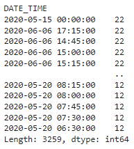
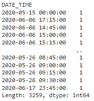

# Solar Generation Data - Predictive Analysis

## Domain Proyek

Energi terbarukan menjadi alternatif yang banyak dipakai untuk menggantikan sumber energi konvensional, seperti minyak bumi dan batu bara. Keunggulan dari sumber energi ini, selain tidak akan habis, adalah rendahnya residu dari proses pembangkitan listrik. Residu yang dimaksud seperti gas rumah kaca dari pembakaran batu bara pada Pembangkit Listrik Tenaga Uap (PLTU), yang berbahaya bagi lingkungan dan dapat menyebabkan pemanasan global. Oleh karena itu, berbagai *stakeholder* terus berupaya meningkatkan porsi pemanfaatan sumber energi terbarukan dalam memenuhi kebutuhan energi.

Salah satu jenis energi terbarukan yang populer adalah energi surya. Energi ini memiliki kapasitas pembangkitan yang terus meningkat dari tahun ke tahun [1, 2]. Selain itu, implementasi energi surya, seperti dengan panel Photo-Voltaic (PV), mengalami penurunan biaya dari tahun ke tahun [3]. Penelitian dalam bidang pembangkitan energi surya, material panel PV, dan teknologi pengumpulan energi surya juga telah banyak dilakukan [4]. Hal ini menunjukkan potensi energi surya untuk mengurangi konsumsi energi dari sumber konvensional dan tidak ramah lingkungan.

Hal yang perlu diperhatikan adalah kapasitas energi yang dihasilkan energi surya belum bisa sepenuhnya menggantikan sumber energi konvensional. Oleh karena itu, ketika sebuah Pembangkit Listrik Tenaga Surya (PLTS) dihubungkan ke jaringan distribusi listrik (*grid*), energi yang diproduksi PLTS harus dapat disesuaikan dengan energi dari PLTU atau pembangkit lain. Apabila seluruh pembangkit memproduksi energi tanpa memperhatikan kondisi atau kapasitas jaringan, hal ini dapat membahayakan seluruh grid.

Di sinilah pentingnya model untuk memprediksi produksi energi surya pada PLTS. Apabila energi yang dihasilkan dapat diketahui *trend*-nya, pihak yang mengoperasikan grid dapat dengan mudah mencegah *overcapacity* atau *under-capacity*. Energi surya pada akhirnya dapat membantu memenuhi konsumsi energi tanpa menyebabkan kerusakan atau gangguan pada grid. Hal yang dibutuhkan adalah model prediksi pembangkitan energi listrik dari PLTS yang akurat. Di proyek ini, akan dibentuk model prediksi yang dapat dimanfaatkan untuk kepentingan tersebut dengan mengamati penelitian yang telah ada [5,6]. 

## Business Understanding

### Problem Statement

Pembangkit Listrik Tenaga Surya menghasilkan energi secara fluktuatif dan tidak dapat dikendalikan. Setiap pembangkit yang dihubungkan ke jaringan distribusi listrik (*grid*) perlu diatur sedemikian rupa sehingga tidak menyebabkan gangguan/kerusakan. Oleh karena itu, energi dari PLTS harus dapat diprediksi agar membantu pengaturan PLTS ketika dihubungkan dengan grid.

### Goals

Proyek ini bertujuan untuk menghasilkan model prediksi dari produksi energi PLTS dengan memanfaatkan data pengamatan cuaca.

### Solution Statement

Untuk memenuhi tujuan tersebut, akan diajukan empat model regresi:
1.   Support Vector Machine (SVM)
2.   Random Forest
3.   Adaptive Boosting
4.   Gradient Boosting

Masing-masing model akan dibandingkan kinerjanya dengan metrik R2.

## Data Understanding Part 1

Dataset yang akan digunakan adalah data dua PLTS di India selama 34 hari. Setiap PLTS menghasilkan data pembangkitan daya pada level inverter dan data pembacaan sensor pada array PV. Data ini dapat diunduh dari [Kaggle](https://www.kaggle.com/datasets/anikannal/solar-power-generation-data?select=Plant_2_Generation_Data.csv). 

Dataset pertama adalah data pembangkitan daya PLTS. Di sini, terdapat beberapa variabel:
* DATE_TIME: Waktu pengamatan dengan interval 15 menit;
* PLANT_ID: Nomor identitas PLTS;
* SOURCE_KEY: Kode identitas inverter;
* DC_POWER: jumlah daya DC yang dihasilkan inverter tiap 15 menit (kiloWatt);
* AC_POWER: jumlah daya AC yang dihasilkan inverter tiap 15 menit (kiloWatt);
* DAILY_YIELD: jumlah kumulatif energi yang dipanen inverter pada hari tersebut (kWh);
* TOTAL_YIELD: jumlah energi yang dipanen inverter hingga waktu tersebut (kWh)

Dataset kedua adalah data pembacaan sensor di array PV PLTS. Di sini, terdapat beberapa variabel:
* DATE_TIME: Waktu pengamatan dengan interval 15 menit;
* PLANT_ID: Nomor identitas PLTS;
* SOURCE_KEY: Kode identitas sensor;
* AMBIENT_TEMPERATURE: suhu ambient PLTS (derajat Celcius);
* MODULE_TEMPERATURE: suhu module PV (derajat Celcius);
* IRRADIATION: jumlah iradiasi setiap 15 menit (W/m2)

### Exploratory Data Analysis (EDA) and Visualization

Pada dua dataset yang digunakan, daat diketahui bahwa dataset diperoleh dari dua sensor berbeda, tetapi pada rentang waktu yang sama. Hal ini diketahui dari laman [Kaggle](https://www.kaggle.com/datasets/anikannal/solar-power-generation-data?select=Plant_2_Generation_Data.csv) serta Gambar 1 dan Gambar 2. Selain itu, pada Dataset 1, jumlah pembacaan sensor untuk satu waktu tertentu berjumlah lebih dari satu. Hal ini dilihat dari hasil pada Gambar 1. Oleh karena itu, di sini, Dataset 1 akan dicari **nilai rata-rata (*mean*)** untuk satu waktu spesifik. Kedua dataset kemudian dapat digabungkan untuk menghasilkan satu dataset baru. Hal ini untuk memudahkan pengolahan data lebih lanjut. 

  
Gambar 1. Jumlah Nilai Unik pada DATE_TIME Dataset 1

  
Gambar 2. Jumlah Nilai Unik pada DATE_TIME Dataset 2

Pada pengecekan tipe data tiap kolom, data pada kolom DATE_TIME masih berupa object. Oleh karena itu, data pada kolom tersebut perlu dikonversi menjadi tipe data *datetime*. Data identitas PLTS dan sensor (PLANT_ID dan SOURCE_KEY) tidak digunakan untuk melatih model sehingga dapat dibuang. 

Setelah dilakukan beberapa pengolahan, dataset baru dapat dicek. Untuk memudahkan, visualisasi dengan *pairplot, heatmap, dan boxplot* dilakukan. Informasi dari masing-masing plot adalah sebagai berikut:
* Pairplot: informasi distribusi data,
* Heatmap: informasi korelasi setiap fitur,
* Boxplot: informasi terkait *outliers*

Melalui Heatmap, dapat diketahui bahwa data pada kolom TOTAL_YIELD memiliki korelasi yang rendah dengan data pada kolom lain karena mendekati nol. Oleh larena itu, data di kolom ini dapat dibuang. Dari boxplot, masih terdapat outliers pada kolom MODULE_TEMPERATURE dan IRRADIATION. Oleh karena itu, untuk membersihkannya, akan digunakan metode IQR.

Setelah mengecek ulang data, dapat diketahui dari pairplot bahwa kolom AC_POWER, DC_POWER, dan IRRADIATION memiliki nilai nol yang banyak. Oleh karena itu, di sini, data tersebut akan dihilangkan.

## Data Preparation

### Principal Component Analysis

Dari pairplot dan heatmap, dapat diketahui bahwa data AC_POWER dan DC_POWER memiliki korelasi yang sangat tinggi. Oleh karena itu, untuk mengurangi dimensi data, akan dilakukan PCA terhadap dua kolom tersebut. Hasilnya adalah sebuah fitur agregat bernama OUTPUT_POWER.

### Train-Test Split

Setelah data siap, akan dilakukan pembagian dataset untuk kebutuhan pelatihan dan evaluasi. Di sini, data akan dibagi dengan rasio 80:20. Label atau nilai yang akan diprediksi adalah DAILY_YIELD, yaitu total energi yang dipanen secara harian. Kolom sisanya akan menjadi fitur untuk latihan. Selain itu, data DATE_TIME tidak akan digunakan sehingga dapat dibuang.

### Scaling

Fitur data latih memiliki rentang nilai yang berbeda-beda. Hal ini dapat meningkatkan kesalahan dari model sewaktu pelatihan. Oleh karena itu, data latih akan dilakukan Min-Max Scaling untuk mengubah setiap fitur menjadi dalam rentang [0,1]. Data uji akan dilakukan scaling secara terpisah untuk mencegah kebocoran data.

## Model Development

Hal pertama yang dilakukan adalah mempersiapkan DataFrame untuk membandingkan kinerja model.

### Random Forest

Model pertama yang digunakan adalah Random Forest. Model ini adalah model ensmble (gabungan) dari model-model individu (estimator), seperti Decision Tree. Model ini akan menjalankan prediksi secara pararel.

Di sini, parameter yang digunakan untuk model Random Forest adalah jumlah estimator (n_estimators) dan kedalaman pohon maksimal (max_depth). Untuk memperoleh parameter terbaik digunakan metode Grid Search yang menghasilkan parameter:
* n_estimators = 150
* max_depth = 32

Pada model ini dan model selanjutnya juga terdapat parameter random_state yang digunakan untuk mengatur random number generator sehingga model akan selalu memiliki output yang sama.

### SVM

Model kedua yang digunakan adalah Support Vector Machine (SVM). Tujuan dari model ini adalah mencari hyperplane yang memiliki margin paling besar. 

Pada SVM terdapat beberapa parameter. Pertama, kernel adalah fungsi yang digunakan untuk memetakan data berdimensi rendah ke dimensi yang lebih tiggi. Kedua, gamma adalah koefisien dari kernel. Ketiga, C adalah parameter regularisasi. Dengan Grid Search, diperoleh parameter terbaik:
* kernel = poly
* gamma = 1
* C = 1

### Adaptive Boosting

Adaptive Boosting (AdaBoost) adalah model ensemble seperti Random Forest. Perbedaannya, model dilatih secara sekuensial dengan menggabungkan model-model lemah menjadi model yang lebih kuat.

Di sini, terdapat beberapa perameter yang digunakan. Pertama, n_estimators adalah jumlah model individu yang digabungkan. Kedua, learning_rate yaitu bobot yang dikenakan ke regressor tiap iterasi. Ketiga, loss yaitu fungsi loss yang digunakan untuk mengubah bobot tiap iterasi. Di sini, dengan Grid Search diperoleh parameter terbaik:
* learning_rate = 0.05
* n_estimators = 100
* loss = exponential

### Gradient Boosting

Gradient Boosting (GradBoost) adalah varian algoritma Boosting seperti AdaBoost. Perbedaannya, GradBoost merupakan algoritma yang lebih umum sehingga lebih fleksibel untuk diapliaksikan ke setiap kasus.

Pada kasus ini, parameter yang digunakan adalah:
* n_estimators, yaitu jumlah model individu
* learning_rate, yaitu ukuran mengecilnya kontribusi estimator tiap iterasi
* loss, fungsi loss yang dioptimisasi
* subsample, ukuran potongan sampel yang digunakan untuk melatih model individu,
* criterion, fungsi untuk mebgukur kualitasi pemisahan (*split*)

Dengan Grid Search, diperoleh parameter terbaik:
* n_estimators = 200,
* learning_rate = 0.05,
* loss = huber,
* subsample = 0.5,
* criterion = mse

### Training Comparison

Dari nilai R2 proses latih, dapat diketahui bahwa **model Random Forest** memiliki skor tertinggi sehingga layak dipilih menjadi solusi. Di sini, Random Forest memiliki R2 = 0,97.

## Evaluation

Sebelum melakukan evaluasi, data uji akan dikenakan scaling terlebih dahulu.

Seperti telah disebutkan sebelumnya, metrik yang digunakan untuk mengukur kinerja model prediksi adalah nilai **R2**. Nilai ini diperoleh dengan mengikuti persamaan:

R2  = 1 - (SSE/SST)  
SSE = sum((y_true - y_pred)2)  
SST = sum((y_true - mean(y_true))2)

Dari nilai R2, model dapat dibagi menjadi tiga:
1.   Model yang akurat, yaitu apabila nilai R2 mendekati 1.0
2.   Model biasa, yaitu apabila nilai R2 di sekitar 0.0
3.   Model buruk, yaitu yaitu nilai R2 kurang dari 0.0

Dari proses latih dan evaluasi, dapat diketahui bahwa **model Random Forest** memiliki nilai R2 yang mendekati satu sehingga dapat dikatakan sebagai model prediksi yang akurat. Random Forest memiliki nilai R2 latih dan uji masing-masing sebesar **0,97 dan 0,89**. Dengan begitu, model ini dapat dipilih untuk melakukan prediksi energi yang dihasilkan PLTS dalam kurun waktu tertentu.

Untuk membuktikan bahwa model Random Forest dapat memenuhi tujuan proyek, dilakukan prediksi terhadap data acak pada data uji. Di sini, untuk **nilai energi 4939,1 kWh**, model Random Forest memprediksi dengan **angka 4811,7 kWh**. Nilai prediksi yang tidak terlalu jauh dari nilai sesungguhnya.

## Conclusion

Dari proyek ini, dapat diketahui bahwa prediksi energi matahari yang dihasilkan PLTS penting untuk pengaturan PLTS ketika dihubungkan ke grid. Oleh karena itu, dibentuk model prediksi berbasis *machine learning* untuk memenuhi tujuan tersebut. Model tersebut adalah Random Forest. Model ini memiliki nilai R2 latih dan uji di angka 0,97 dan 0,89. Selain itu, model ini mampu memberikan prediksi output energi PLTS dengan kesalahan yang tidak begitu besar dari nilai sesungguhnya. Dengan begitu, pada proyek ini, diusulkan model Random Forest untuk melakukan prediksi energi pada PLTS.

**Referensi:**  
[1] REN21, P.S., Renewables 2014: Global Status Report. 2014: Secretariat
Renewable Energy Policy Network for the 21st Century (REN21) Paris.  
[2] International Energy Agency, International Energy Statistics. 2014; Available
from: 〈http://www.eia.gov/cfapps/ipdbproject/IEDIndex3.cfm〉.  
[3] Price of crystaline silicon photovoltaic cells; 2012. Available from: 〈http://
www.economist.com/blogs/graphicdetail/2012/12/daily-chart-19〉  
[4] Kannan, N., & Vakeesan, D. (2016). Solar energy for future world:-A review. Renewable and Sustainable Energy Reviews, 62, 1092-1105.  
[5] Sharma, N., Sharma, P., Irwin, D., & Shenoy, P. (2011, October). Predicting solar generation from weather forecasts using machine learning. In 2011 IEEE international conference on smart grid communications (SmartGridComm) (pp. 528-533). IEEE.  
[6] Yesilbudak, M., Çolak, M., & Bayindir, R. (2016, November). A review of data mining and solar power prediction. In 2016 IEEE International Conference on Renewable Energy Research and Applications (ICRERA) (pp. 1117-1121). IEEE.